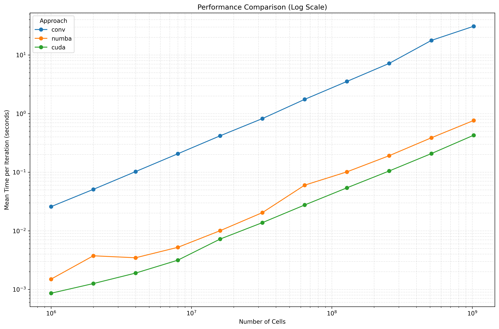
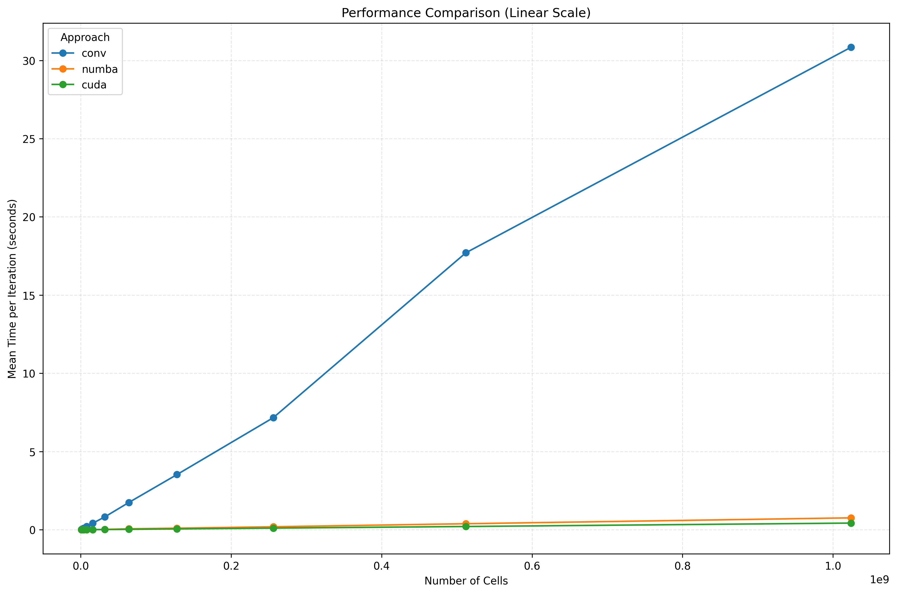
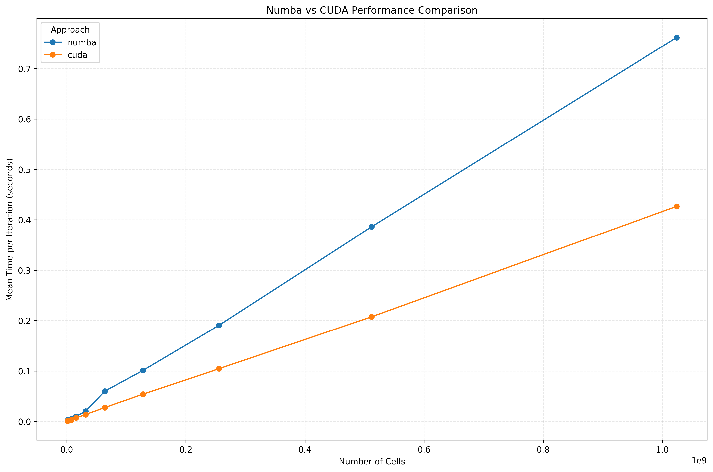

# Game of Life: Performance Comparison of Different Implementations

This project explores various implementations of Conway's Game of Life, each optimized using different computational approaches. The goal is to compare their performance characteristics across different problem sizes.

## Implementations

### 1. Basic Implementation
- **File**: `src/basic_gol.py`
- **Description**: A straightforward Python implementation using nested loops for cell updates.
- **Strengths**: Simple to understand, no external dependencies.
- **Weaknesses**: Poor performance for large grids due to Python's interpreted nature.

### 2. Convolution-based Implementation
- **File**: `src/conv_gol.py`
- **Description**: Uses NumPy's convolution operation to compute neighbor counts.
- **Strengths**: Vectorized operations, better performance than basic Python.
- **Weaknesses**: Memory intensive for very large grids.

### 3. Numba-accelerated Implementation
- **File**: `src/numba_gol.py`
- **Description**: Uses Numba's JIT compilation to optimize the basic implementation.
- **Strengths**: Significant speedup over pure Python with minimal code changes.
- **Weaknesses**: Still runs on CPU, limited by single-threaded performance.

### 4. CUDA Implementation
- **File**: `src/cuda_gol.py`
- **Description**: GPU-accelerated implementation using Numba's CUDA capabilities.
- **Strengths**: Massive parallelization, best performance for large grids.
- **Weaknesses**: Requires CUDA-capable GPU, more complex implementation.

## Performance Comparison

### Performance at Largest Grid Size (1,024,000,000 cells)

| Approach    | Mean Time per Iteration (s) | Relative Speed |
|-------------|----------------------------|----------------|
| Convolution | 30.84                      | 1.0x (baseline)|
| Numba       | 0.76                       | 40.6x faster   |
| CUDA        | 0.43                       | 71.7x faster   |

Note: Basic implementaiton is not listed because it is too slow to run for the largest grid size.
### Performance Analysis

1. **Convolution vs Optimized Implementations**:
   - The convolution approach, while vectorized, is significantly slower than both Numba and CUDA implementations.
   - This demonstrates the overhead of the convolution operation compared to direct neighborhood computation.

2. **Numba Performance**:
   - Provides excellent speedup (40x) over the convolution approach.
   - Performance scales linearly with problem size.
   - Ideal for systems without GPU acceleration.

3. **CUDA Performance**:
   - Delivers the best performance (71.7x faster than convolution).
   - Shows superior scaling for larger problem sizes.
   - The performance gap widens as the grid size increases.

## Performance Plots

### 1. Log Scale Comparison

- Shows performance across different grid sizes with logarithmic axes.
- Demonstrates the scaling behavior of each approach.

### 2. Linear Scale Comparison

- Shows absolute performance differences between implementations.
- Makes it easier to see the performance gap at different scales.

### 3. Numba vs CUDA

- Direct comparison between the two fastest implementations.
- Highlights the advantage of GPU acceleration for this problem.

## Key Findings

1. **Performance Scaling**:
   - All implementations show roughly linear scaling with problem size.
   - CUDA shows the most consistent performance improvements at larger scales.

2. **Crossover Points**:
   - For very small grids, the overhead of GPU initialization makes the difference less significant.
   - The performance advantage of CUDA becomes more pronounced as the grid size increases.

3. **Practical Implications**:
   - For small to medium grids, Numba provides an excellent balance of performance and simplicity.
   - For large-scale simulations, CUDA is the clear winner in terms of raw performance.

## Requirements

- Python 3.7+
- NumPy
- Numba
- CUDA Toolkit (for CUDA implementation)
- Matplotlib (for generating plots)

## Running the Code

1. Install dependencies:
   ```bash
   pip install numpy numba matplotlib
   ```

2. Run the performance benchmark:
   ```bash
   cd src
   python run_exp.sh
   ```

3. Generate performance plots:
   ```bash
   python plot_performance.py output.csv
   ```

## Conclusion

This project demonstrates how different computational approaches can significantly impact the performance of the Game of Life simulation. The choice of implementation should be based on the specific requirements of your application, considering factors like grid size, hardware availability, and development complexity.
